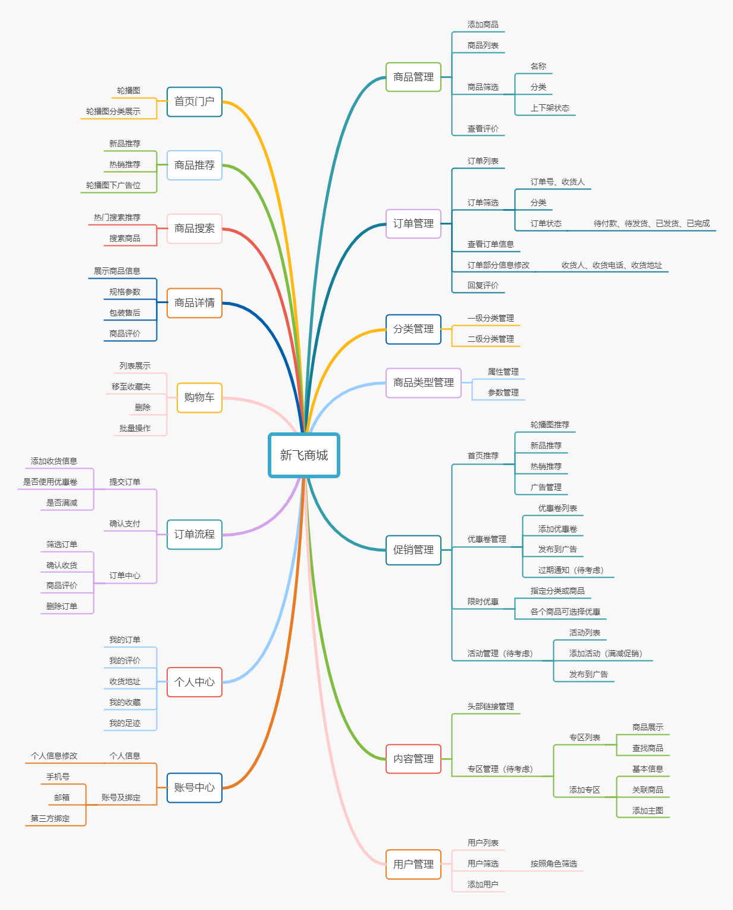
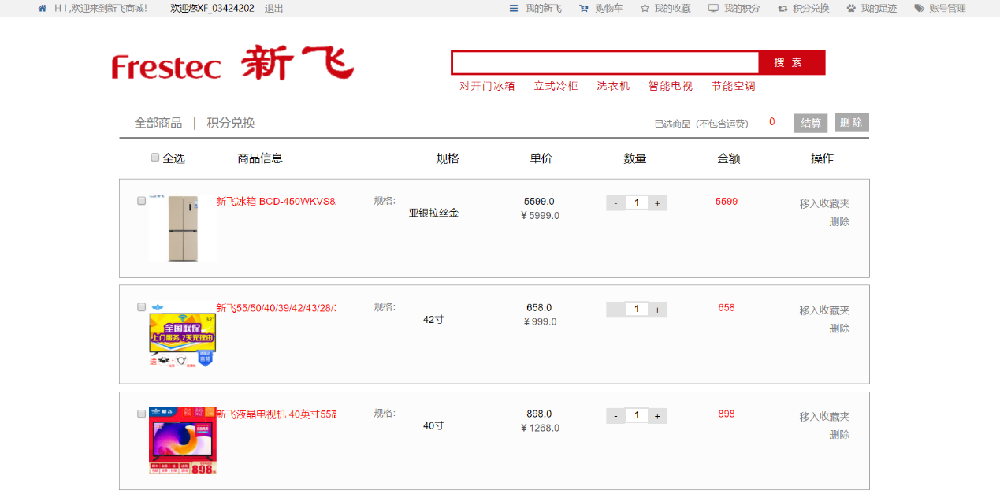

<h1 align="center">new-flyer-mall</h1>

#### 项目介绍

**该项目写于2018年5月，写时水平较差，预计2020.05进行重构。**

新飞商城，一个经营家用电器的网上商城，以“产品、价格，服务”为核心，为消费者提供质优的商品，优惠的价格，上门配送等服务。

本系统是一个单租户的电商系统，包含了商城应有的基本功能：商品搜索、购物车、订单、收藏、个人中心、账号中心等模块，分词算法实现的检索商品以及完善的后台管理系统。

#### 模块介绍

#### 技术选型

|                             框架                             |          说明          |  版本  |
| :----------------------------------------------------------: | :--------------------: | :----: |
|    [Spring Boot](https://spring.io/projects/spring-boot)     |      应用开发框架      | 2.0.1  |
|              [MySQL](https://www.mysql.com/cn/)              |      数据库服务器      |  5.7   |
|          [Druid](https://github.com/alibaba/druid)           | JDBC 连接池、监控组件  | 1.1.9  |
| [Spring data jpa](https://spring.io/projects/spring-data-jpa) |     数据持久层框架     | 2.0.6  |
| [BeanUtils](http://commons.apache.org/proper/commons-beanutils/index.html) | Apache的JavaBean工具包 | 1.8.3  |
|       [fastjson](https://github.com/alibaba/fastjson)        | alibaba开源json解析库  | 1.2.33 |
|             [lucene](http://lucene.apache.org/)              |  Apache检索引擎工具包  | 7.1.0  |
|           [Thymeleaf](https://www.thymeleaf.org/)            |   扩展性强的模板引擎   | 3.0.9  |

#### 部分页面展示

